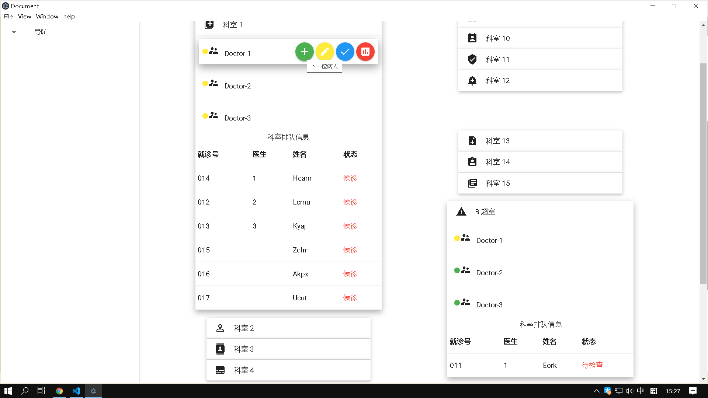
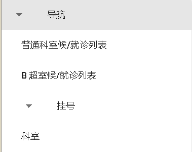
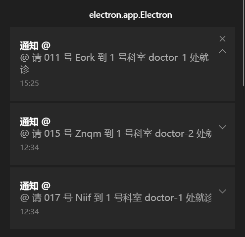

> 使用说明

## 菜单
- File 选项
  - 普通科室候/就诊列表 (Ctrl + D)
    显示普通科室正在就诊的病人以及候诊病人列表
  - B 超室侯/就诊列表 (Ctrl + B)
    显示 B 超室正在检查和等待检查的病人列表
  - 挂号
    - 添加就诊人 (Ctrl + N)
        添加一位就诊人，需输入姓名、年龄、性别、电话号码、科室等信息，若输入不符合规范会进行提示
    - 随机添加病人 (Ctrl + P)
        随机添加输入数量的病人，方便模拟
  - 科室
    显示 16 个科室的信息，包括 B 超室。
    
    将鼠标悬停在医生处会出现若干操作按钮，并有相关文字提示，每个科室下方会有 6 位病人的就诊候诊信息表，病人的状态为 ``候诊``，``就诊`` 以及 ``复诊``，其中 ``复诊`` 病人为做完 B 超检查回到科室的病人。
    医生图标左侧为医生状态信息，有 ``空闲``、 ``病人等候中``、``忙碌`` 等三种状态，医生据此可进行相应的按钮点击操作来 ``接受下一个病人``、``开具 B 超``、``完成就诊``，或者 ``查看历史就诊病人列表``。

  - 查找 (Ctrl + F)
    对页面进行文本查找，方便查询病人信息
  - Clear (Ctrl + E)
    对所有就诊信息进行清空，清空前会进行操作提示/警告。
  - Quit (Ctrl + Q)
    推出程序

- View/Window
    对界面或窗口进行控制

## 导航

左侧导航栏如图所示，包含了 File 选项的部分操作，方便就诊管理

## 叫号
当医生点击下一位病人时，会发送就诊通知。需要确保系统允许应用发送通知。
