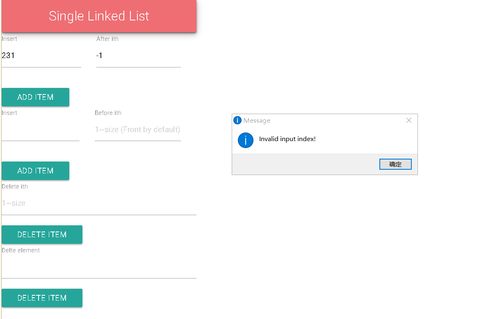
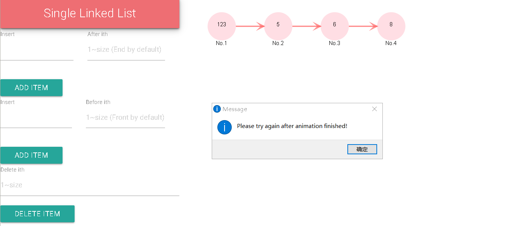

> 使用说明

## 菜单
File 选项:
- 新建单链表 (Shift + S)
建立单链表 (不带头节点)，之前建立的链表会销毁，左上角链表名称会改变。
- 新建双向链表 (Shift + D)
建立双向链表 (不带头节点)，之前建立的链表会销毁，左上角链表名称会改变。
- 新建循环链表 (Shift + C)
建立循环链表 (不带头节点)，之前建立的链表会销毁，左上角链表名称会改变。
- 查找 (Ctrl/Command + F)
对页面文本进行查找，可用于查找元素是否有无
- 清空当前界面 (Ctrl/Command + E)
仅清空链表以及绘制的图形，不会销毁链表
- 退出 (Ctrl/Command + Q)
退出程序

View 选项: 含对窗口的若干操作

## 左侧表单
- 插入元素
设定插入元素**不重复**。分为 Insert After 和 Insert Front，即在某个节点后或者前插入新元素。会对输入的下标进行合法性判断，如图所示:

    

注意： 如果未输入下标，则 Insert After 默认尾插，Insert Before 默认头插。

- 删除第 i 个元素 （同上会对进行下标输入合法判断）

- 删除元素 element
在链表中找到对应元素并删除，没有则进行提示。

## 右键菜单
除了表单操作，还可以**右键节点**进行相关的操作：删除右键节点，在节点前/后插入元素。

以上操作均会有 1 秒左右的动画，动画执行期间上述操作会提示错误，如图所示：
    

        
    

